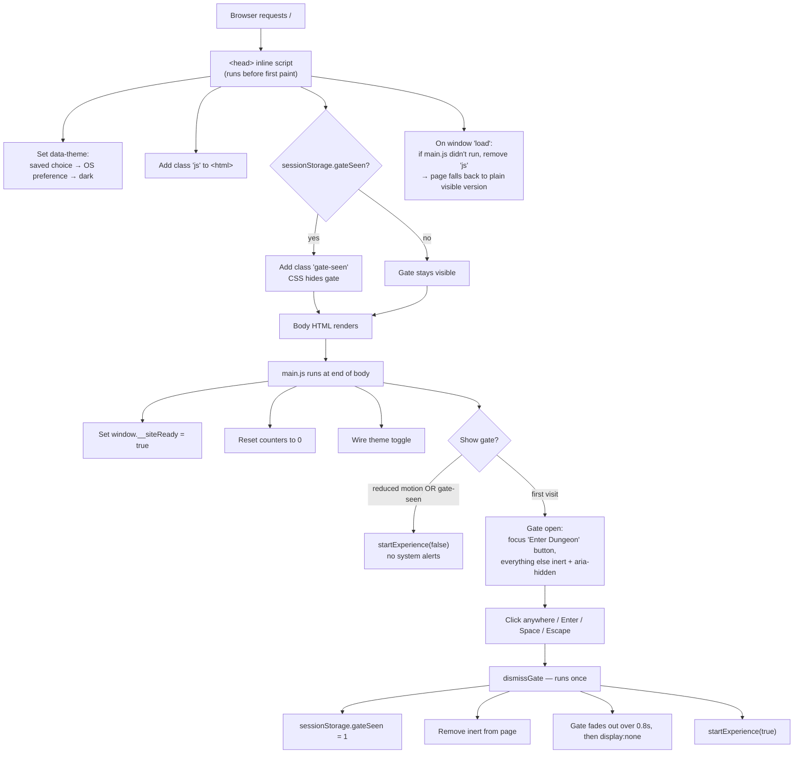

# Portfolio Site — Complete Flow

Solo Leveling–themed portfolio for **Abhimithra Peddi** (AI/ML Engineer).
Repo: `abhimithra02/Portfolio` (formerly `website`) · Hosting: Render **Static Site**

---

## 1. Architecture at a glance

```
GitHub (main) ──push──▶ Render Static Site ──CDN──▶ Browser
                         publish dir: ./public
                         no build step, never sleeps
```

- There's no server code. The site is plain HTML, CSS and JS served from a CDN.
- The site used to be a Flask app on Render's free web service plan. Render puts free web services to sleep after 15 minutes idle, so visitors hit a 30–60s "Service waking up" screen. Converting to a static site removed that wait.

## 2. Project structure

```
render.yaml                  # Render config: runtime static, publish ./public, cache headers
public/
  index.html                 # The whole page (head script + markup)
  static/
    css/style.css            # Theme tokens, layout, animations, no-JS / reduced-motion rules
    js/main.js               # All interactive behaviour
    img/favicon.svg
    img/profile.webp         # Avatar + og:image
    img/profile.jpg
    resume/Abhimithra_Peddi_Resume.pdf
```

`render.yaml`:

```yaml
services:
  - type: web
    name: abhimithra-portfolio
    runtime: static
    buildCommand: echo "No build step"
    staticPublishPath: ./public
    headers:
      - path: /static/*
        name: Cache-Control
        value: public, max-age=3600
```

## 3. Deploy flow

1. Push or merge to `main`.
2. Render redeploys the Static Site automatically and copies `public/` to its CDN.
3. The site is live straight away. Browsers cache CSS, JS and images for 1 hour, so a CSS/JS change can take up to an hour to reach returning visitors.

One-time setup in Render: **New → Static Site**, pick the repo, branch `main`, empty build command, publish directory `public`. Delete the old Flask web service once the new site works.

If the site's address isn't `abhimithra-portfolio.onrender.com`, update the `og:image` and `og:url` lines in `public/index.html`.

## 4. Page load flow



## 5. What `startExperience()` starts

It runs **once**, at the moment the visitor enters (or immediately if the gate is skipped). It adds class `started` to `<html>`, which un-pauses the CSS typing effect.

| Time after entering | What happens |
|---|---|
| 0 ms | Scroll reveal observer starts, so the hero fades in |
| 0 ms | Skill-bar observer starts |
| 0 ms | Particles canvas starts |
| 0 ms | Typing effect un-pauses (CSS: 0.8s delay, then 2.5s to type) |
| ~300 ms after hero reveal | Hero counters: 15 random "rerolls", then count up with ease-out over 0.8s |
| 1200 ms | Side step tracker fades in (hidden below 768px width) |
| 1500 ms | Shadow soldiers canvas starts (not drawn in light theme) |
| 1100 ms (gate path only) | System alerts: 3 messages, 1.8s each plus 0.4s gap |

System alerts:
1. "Player data loaded successfully." / "Welcome, S-Rank Hunter."
2. "Skill analysis complete." / "All abilities indexed."
3. "Shadow army standing by." / "Arise."

## 6. While scrolling

| Feature | Trigger | Behaviour |
|---|---|---|
| Reveal | 10% of element visible | Adds `.visible`: fade/slide in; children of `.stagger-children` fade in one after another |
| Skill bars | 20% of bar visible | Width animates to `data-level`%, plus a one-off "level-up" burst |
| Step tracker + tab title | Section crosses the middle band of the screen (`rootMargin -45% 0 -50% 0`) | Active dot changes; earlier dots marked visited; title becomes `Abhimithra Peddi — <Section>` |
| Step dot click | Click | Smooth-scrolls to the section (instant with reduced motion) |
| Scroll % display | scrollTop > 200 shows, < 100 hides | Shows page scroll percentage (hidden below 500px width) |
| Back to top | scrollTop > 600 shows, < 400 hides | Scrolls to top |
| Cursor aura | Mouse move (not on touch or reduced motion) | Glow follows the cursor |

Scroll work runs at most once per animation frame.

Sections (`data-step`):
1. Identity → "AI/ML Engineer"
2. Professional Summary
3. Technical Skills
4. Experience
5. Key Projects
6. Education

## 7. Theme flow

- **First paint:** the inline `<head>` script picks the theme from `localStorage.theme`, then the OS `prefers-color-scheme`, then falls back to dark. There's no flash of the wrong theme.
- **Toggle button:** switches `data-theme` between light and dark and saves the choice to `localStorage`.
- **Light theme:** shadow soldiers are hidden and skip drawing; particles are at 50% opacity.

## 8. Fallback behaviour

| Situation | Gate | Content | Skill bars | Counters | Effects |
|---|---|---|---|---|---|
| Normal first visit | Shown until entered | Reveals on scroll | Animate | Reroll + count up | All |
| Repeat visit, same browser session | Skipped | Reveals on scroll | Animate | Reroll + count up | All, no alerts |
| Reduced motion | Skipped | Visible, no animation | Filled, no transition | Final value shown | None |
| JavaScript off | Hidden | Fully visible | Filled via `--level` | Real numbers | None; typing shown in full |
| `main.js` fails to load | Hidden (the `load` check removes `js`) | Fully visible | Filled | Real numbers | None |

## 9. Change history

| PR | Change |
|---|---|
| [#1](https://github.com/abhimithra02/Portfolio/pull/1) | Converted Flask to a Render static site. Fixed the flow: no-JS fallback, no theme flash, intro starts from the gate, gate runs once per session, gate accessibility, tall-section tracking, skill-bar burst leak, reduced-motion counters, soldiers skip drawing in light theme, scroll updates once per frame |
| [#2](https://github.com/abhimithra02/Portfolio/pull/2) | "Dungeons Cleared" set to 7 to match the 7 listed projects |

---

## 10. Prompts

### 10a. Prompts used in this session

In order:

1. `analysis the flow`: review how the site works and list its problems.
2. *(screenshot of Render "SERVICE WAKING UP")* `its take to load`: explained the free-plan sleep and the options.
3. `yes convert to static site and fix the flow issues`: PR #1.
4. `yes create the PR` → `merge the PR`
5. `fix the 8 dungeons cleared count to 7`: PR #2.
6. `yes create the PR and merge it`
7. `provide the complete flow in md file with prompt`: this file.

### 10b. Reusable prompt to rebuild or extend the site

Copy this into Claude Code (or any coding assistant) to recreate the site or keep working on it with the same rules:

```text
You are working on my personal portfolio: a single-page, Solo Leveling–themed
static site for "Abhimithra Peddi — AI/ML Engineer", hosted as a Render Static Site.

STRUCTURE
- render.yaml: runtime static, staticPublishPath ./public, Cache-Control 1h on /static/*
- public/index.html, public/static/{css/style.css, js/main.js, img/, resume/}
- No server code and no build step. Use plain relative paths (static/...).
  og:image / og:url must be absolute URLs.

PAGE SECTIONS (each <section data-step="N">)
1 Identity (avatar, name, typing title, 4 stat counters, contact links, resume download)
2 Professional Summary  3 Technical Skills (skill bars with data-level)
4 Experience (quest log)  5 Key Projects (dungeon cards)  6 Education & Achievements

FLOW RULES (keep these working)
- An inline <head> script sets data-theme (localStorage → OS preference → dark),
  adds class "js" to <html>, adds "gate-seen" if sessionStorage.gateSeen is set,
  and on window load removes "js" if window.__siteReady was never set.
- Anything hidden-until-animated in CSS is scoped under .js, so the page is fully
  readable without JS (gate hidden, content visible, skill bars use --level,
  counters show real numbers in the HTML).
- The "Dungeon Gate" splash shows once per browser session. It uses a real
  <button>, gets focus on load, closes on click/Enter/Space/Escape, can only be
  dismissed once, and makes the rest of the page inert while open.
- All intro effects (reveals, counters, typing, particles, step tracker,
  shadow soldiers, system alerts) start from a single startExperience() call
  when the gate is dismissed, not on timers from page load.
- Respect prefers-reduced-motion: skip the gate and all motion, show final values.
- The step tracker and document.title follow the section crossing the middle
  of the viewport, so sections taller than the screen still activate.
- Scroll work runs at most once per animation frame.
- Stat numbers must match the content (e.g. "Dungeons Cleared" = number of project cards).
- No horizontal scroll at 390px width.

WORKFLOW
- Test in a headless browser: first visit, double click, repeat visit, JS off,
  main.js blocked, reduced motion, light theme, mobile width. No console errors.
- Commit with a clear message, open a PR to main, merge when I approve.

TASK: <describe the change you want here>
```
